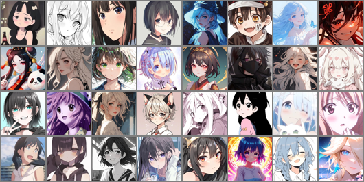
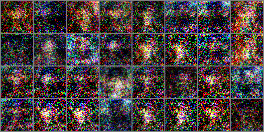
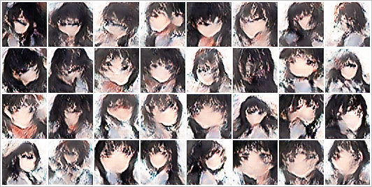
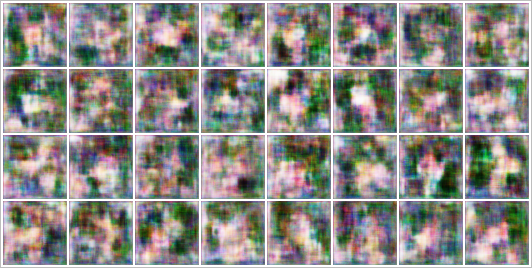
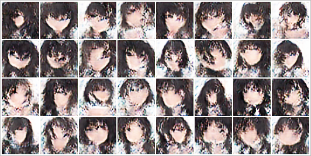
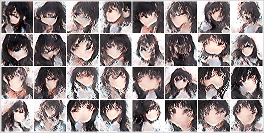

# 实验效果画廊

本页面使用项目中实际保存的训练样图，展示从真实数据、基础 GAN 到 DCGAN 的演进过程。所有判断均限于当前项目内部对比。

[返回首页](../README.md) · [查看产品案例](PRODUCT_CASE_STUDY.md)

## 1. 最终效果概览

当前最佳样图对应第 464 epoch 保存的模型节点。可以观察到大多数样本已经形成动漫人脸、头发和正面头像构图，但眼睛、嘴部、边缘纹理和风格多样性仍存在明显提升空间。

## 2. 真实样本、基础 GAN 与 DCGAN

| 真实训练样本 | 基础 GAN：500 epoch | DCGAN：500 epoch |
| --- | --- | --- |
|  |  |  |

### 观察

- 真实样本包含不同发色、画风、姿态和明暗风格。
- 全连接 GAN 在 500 epoch 后仍主要表现为彩色散斑，未形成稳定人脸结构。
- DCGAN 能形成明显的人脸、头发和肩部轮廓，证明卷积结构更适合作为本项目的主模型。
- DCGAN 生成结果仍偏向相似的深色头发与正面构图，说明多样性不足。

## 3. DCGAN 训练演进

| 50 epoch | 250 epoch |
| --- | --- |
|  |  |

| 450 epoch | 最佳节点：464 epoch |
| --- | --- |
|  |  |

### 阶段结论

| 阶段 | 可见特征 | 产品判断 |
| --- | --- | --- |
| 50 epoch | 主要是模糊色块，仅能看到头像式构图 | 模型开始学习总体分布，尚不具备展示价值 |
| 250 epoch | 出现较稳定的人脸、发型和肤色结构 | 技术路线基本验证，可继续训练与调优 |
| 450 epoch | 人脸结构更集中，风格趋于稳定 | 已形成可展示原型，但多样性和细节仍不足 |
| 464 epoch | 日志中的最低生成器 epoch 损失，保存为最佳节点 | 作为当前推荐权重，而非机械选择最后一轮 |
| 500 epoch | 整体效果与后期样本接近 | 作为最终训练节点保留，不直接等同于最佳模型 |

## 4. 日志证据

主训练日志 `DCGAN/training_log.txt` 共记录 500 个 epoch。关键节点如下：

| Epoch | d_loss | g_loss | D_real | D_fake |
| ---: | ---: | ---: | ---: | ---: |
| 1 | 1.960830 | -0.071678 | 0.521452 | 0.511673 |
| 50 | 1.995193 | -0.027133 | 0.503643 | 0.502442 |
| 250 | 1.955101 | -0.052938 | 0.524815 | 0.513611 |
| 450 | 1.887786 | 0.011690 | 0.529309 | 0.501493 |
| 464 | 1.936917 | **-0.369144** | 0.616140 | 0.600771 |
| 500 | 1.814240 | 0.260242 | 0.523003 | 0.477112 |

> GAN 的损失不能脱离图片质量单独用于模型排名。这里的日志是训练诊断和最佳节点选择的辅助证据，视觉完整性、多样性与伪影仍需共同检查。

## 5. 方案决策

### 保留基础 GAN 的原因

虽然基础 GAN 结果较差，但它提供了清晰的内部基线，能够说明模型结构升级的必要性，也适合用于教学展示。

### 选择 DCGAN 的原因

DCGAN 通过卷积处理局部空间关系，实际样图中能够形成基础 GAN 未学到的人脸结构，因此成为当前主方案。

### 选择最佳节点而非最终节点

对抗训练会持续震荡，最后一个 epoch 不一定具有最佳视觉质量。项目保留 `generator_best.pth`、`generator_ema_best.pth` 与最终权重，允许推理和评估时进行独立比较。

## 6. 下一步评估建议

- 使用固定 hold-out 真实图片和固定数量的生成图片计算 FID/KID。
- 固定 checkpoint、随机种子、预处理和评估工具版本。
- 建立人工检查表：人脸结构完整性、五官错误、明显噪点、重复构图和样本多样性。
- 记录单张与批量生成耗时，为在线 Demo 的体验设计提供依据。
- 对不同预处理实验使用同一模型和同一评估协议，避免只看单次样图得出结论。

