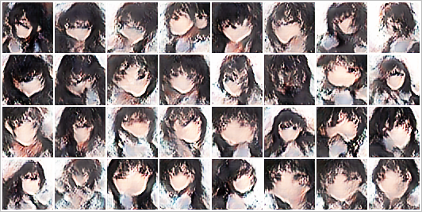
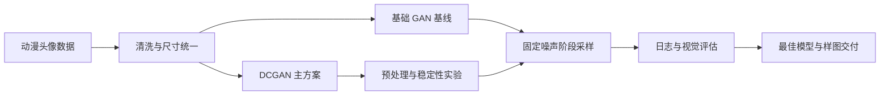

# 产品案例：动漫头像生成 AI 原型

## 一句话概述

面向二次元用户和内容创作者，验证低成本、可批量生成动漫头像的 AI 方案，并完成从数据准备、模型选型、实验设计到效果交付的端到端原型。

> 项目属性：生成式 AI 产品验证 / 个人实验项目  
> 当前阶段：技术可行性验证完成，尚未进入真实用户验证  
> 核心模型：基础 GAN + DCGAN  
> 当前输出：64×64 动漫头像、训练权重、实验日志与结果样图

## 1. 项目背景

个性化头像是生成式 AI 中需求明确、结果易感知、适合快速验证的应用场景。传统头像定制依赖设计师或固定素材模板，存在制作成本高、交付周期长和个性化程度有限等问题。

本项目从动漫头像切入，希望回答三个问题：

1. 小规模数据和有限算力下，GAN 是否能够形成可辨识的动漫人脸？
2. 相比全连接 GAN，DCGAN 是否更适合保留图像的局部空间结构？
3. 数据预处理和训练稳定性策略，能否明显改善生成质量？

## 2. 目标用户与使用场景

### 潜在目标用户

- 需要社交头像的二次元用户。
- 需要快速获得人物素材的内容创作者。
- 需要批量生成 NPC 或占位角色素材的独立游戏团队。
- 希望体验生成式 AI 的教学与研究用户。

### 核心使用场景

- 随机生成一组动漫头像并选择喜欢的结果。
- 使用相同随机种子复现某个头像。
- 批量生成头像，用于素材筛选和创意启发。
- 对比不同模型或训练版本的生成效果。

## 3. MVP 范围

本阶段聚焦“技术是否可行”，MVP 范围控制为：

- 输入：随机噪声。
- 输出：64×64 彩色动漫头像网格。
- 模型：基础 GAN 与 DCGAN。
- 过程能力：数据预处理、训练、阶段采样、日志记录、最佳权重保存。
- 验证方式：固定噪声下的跨 epoch 视觉对比，并结合生成器/判别器日志诊断训练状态。

暂不包含文本提示词、指定发色/表情、真人照片转动漫、在线账户系统和付费能力。

## 4. 产品与技术方案

### 模型选型

基础 GAN 使用全连接网络，将图片展平后生成和判别，适合作为教学与对比基线；DCGAN 使用卷积结构，能够保留图片中的局部空间关系，因此被选为主实验方向。

### 数据实验

项目分别保存了锐化、饱和度、对比度、高斯模糊、组合处理和不同尺寸预处理结果，目的是判断输入数据质量和分布变化对生成效果的影响。

### 稳定性策略

主 DCGAN 代码和训练笔记中包含 TTUR、Instance Noise、轻量 DiffAug、Hinge Loss、Spectral Normalization、Lazy R1 和 EMA 等策略，用于缓解判别器过强、棋盘格、梯度不稳定和后期震荡问题。

## 5. 实验设计与决策

| 阶段 | 主要问题 | 采取的行动 | 决策结果 |
| --- | --- | --- | --- |
| 基线验证 | 全连接 GAN 能否生成头像 | 训练基础 GAN 至 500 epoch | 输出仍以彩色噪点为主，只保留为基线 |
| 模型升级 | 基线难以学习人脸空间结构 | 切换至 DCGAN | 能逐步形成脸型、头发和五官轮廓，确定为主方案 |
| 数据实验 | 原始图片质量和尺寸不一致 | 测试锐化、对比度、饱和度、模糊和裁剪 | 保存各组结果，为后续定量评估保留依据 |
| 稳定训练 | GAN 容易震荡、判别器过强 | 引入 TTUR、正则化、增强和 EMA | 训练完整运行至 500 epoch，并保存最佳节点 |
| 模型选择 | 最后一个 epoch 不一定最好 | 结合固定样图与日志保存最佳模型 | 第 464 epoch 被记录为最佳生成器节点 |

## 6. 结果与证据

### 可确认的项目结果

- 基础 GAN 和 DCGAN 均完成了可运行的训练流程。
- 主 DCGAN 训练日志完整记录 500 epoch。
- DCGAN 从第 50 epoch 的模糊色块，逐步发展到第 250 epoch 的人脸结构，并在第 450–500 epoch 形成相对稳定的动漫头像。
- 训练程序记录的最佳生成器节点为第 464 epoch：`g_loss=-0.369144`。
- 第 500 epoch 的 `g_loss=0.260242`，说明不能仅以“最后一次训练”代替最佳版本选择。
- 已交付源码、训练日志、模型权重、阶段样图和 13 组数据/实验归档。

详细视觉证据见 [实验效果画廊](EXPERIMENT_GALLERY.md)。

### 当前不能宣称的结果

项目尚未完成真实用户测试，也没有统一协议下的 FID/KID 数据，因此不能宣称“达到商业可用”“用户满意度提升”或“优于某个行业模型”。当前结论限于：技术链路可运行，DCGAN 的视觉结果明显优于项目内的全连接 GAN 基线。

## 7. 产品经理视角下的价值

- **问题拆解**：将“生成动漫头像”拆分为数据质量、模型结构、训练稳定性和效果评估四类问题。
- **方案对比**：通过 GAN/DCGAN 和多种数据处理实验，而不是依赖单一方案得出结论。
- **范围管理**：先验证随机头像生成，不提前扩展到文本控制、账户和商业化功能。
- **数据驱动决策**：保留日志、固定样本和最佳 checkpoint，避免只凭单张效果图判断。
- **风险意识**：明确模型效果、版权来源、分辨率和可控性边界，不夸大实验结论。

## 8. 局限与风险

- 输出分辨率仅为 64×64，细节和五官完整性仍有限。
- 生成结果的发色、构图和风格多样性不足，部分样本存在面部扭曲和噪点。
- 当前没有文本、标签或参考图控制，用户无法指定发色、表情或角色属性。
- 尚未建立 FID/KID、推理时延、失败样本率等统一评估协议。
- 本地筛选集混有不同来源图片，公开或商业使用前必须进行版权审计。
- 模型权重与数据体积较大，不适合直接作为轻量客户端能力部署。

## 9. 下一阶段路线图

### P1：可复现与评估

- 增加独立推理脚本和配置文件。
- 固定评估数据、随机种子和样本数量。
- 补充 FID/KID、推理速度、重复率和失败样本率。

### P2：可交互 Demo

- 提供随机种子、生成数量和批量下载功能。
- 展示模型版本、生成耗时和使用限制。
- 使用 Gradio 或 Streamlit 发布体验页面。

### P3：用户可控生成

- 引入发色、表情、配饰等标签条件。
- 增加“重新生成相似头像”和结果收藏能力。
- 开展小规模用户测试，记录生成成功率与结果选择率。

### P4：商业与合规验证

- 使用授权明确的数据重新训练。
- 评估模型、数据、生成内容的商业使用边界。
- 根据用户验证结果决定头像会员、创作工具或素材 API 方向。

## 10. 面试版项目介绍

> 我在实习期间完成了一个动漫头像生成的 AI 原型。项目先以全连接 GAN 建立基线，但训练 500 轮后仍以噪点为主，因此我将方案切换为更适合图像空间结构的 DCGAN，并围绕数据预处理和训练稳定性进行了多组实验。我通过固定随机噪声、阶段样图和训练日志跟踪效果，最终完整训练 500 轮，并选择第 464 轮作为最佳节点，而不是直接使用最后一轮。项目最终沉淀了代码、模型权重、数据归档和实验记录。下一步会补充定量指标与交互式 Demo，把技术验证升级为可供用户体验的产品原型。

